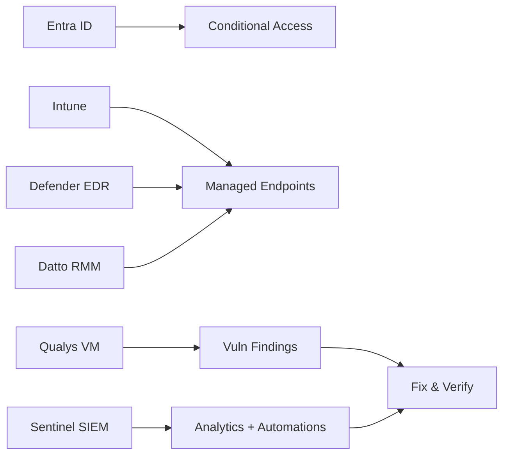

<!-- =========================================================
   ABY GEORGE • CLOUD | DEVSECOPS | CYBER • @Abzlux
   ========================================================= -->

<!-- HERO -->
<p align="center">
  
</p>

<!-- TYPING STRAPLINE (neon cyber vibe) -->
<p align="center">
  
</p>

<!-- DEVSECOPS STRIP (cyber radar) -->
<p align="center">
  
</p>

<!-- QUICK TAGS -->
<p align="center">
  
  
  
  
  
</p>

---

## Stack • The Everyday Arsenal

<!-- ICON GRID (brand/tech-only) -->
<p align="center">
  <!-- Cloud -->
  
  
  
  <!-- DevOps -->
  
  
  
  <!-- Sec & Identity -->
  
  <!-- Observability -->
  
  
  <!-- Dev -->
  
  
</p>

<!-- MICRO DASH (devsecops loop visuals) -->
<p align="center">
  
</p>

---

## Professional Summary

Cloud DevOps and Cybersecurity enthusiast with a background in mechanical engineering and international experience across solar, automotive, and IT support. Currently upskilling in Azure cloud, automation, infrastructure security, and penetration testing. Proven in deploying and securing cloud environments for startups and client orgs. Actively building hands-on DevOps, cybersecurity labs, and automation solutions while designing a cloud‑native solar tech platform.

---

## Core Skills

▰ Cloud Platforms: Azure, Oracle Cloud Free Tier, M365, Entra, Cloudflare Zero Trust  
▰ DevOps & Automation: Docker, Linux (Ubuntu), GitHub Actions, Terraform, Bash, Nginx, CI/CD  
▰ Cybersecurity: Defender for Endpoint, Microsoft Sentinel, Intune, security patching, Zero Trust  
▰ Penetration & Monitoring: Kali (learning), Metasploit, Wireshark, Homebrew (macOS), nmap  
▰ SaaS Tooling: Microsoft 365 Admin, Entra ID, Intune, Endpoint Manager, Cloudflare Dashboard  
▰ Learning Focus: Kubernetes, CKA, Terraform Associate, OSCP track

---

## AI Tools & Prompt Engineering

▰ Capability: Use AI copilots for infra automation, script generation, error triage, and living documentation  
▰ Tooling in practice:  
▹ ChatGPT Plus (GPT‑4o) — workflow generation, prompt‑driven debugging, automation planning  
▹ Gemini Pro • Claude — multi‑modal testing, research synthesis, pipeline optimisation  
▹ Cursor — contextual code suggestions, shell scripting, YAML/Kubernetes templating  
▹ GitHub Copilot — Terraform, Python, and CI/CD YAML inside VS Code

<p align="center">
  
  
  
  
  
</p>

---

## Projects & Labs

<!-- CYBERSEC SUPPORT -->
<div align="center">

### Cybersecurity Support — Enterprise Stack


</div>

▰ Patch posture uplift across SaaS and endpoints with policy hardening  
▰ Agent‑based patching and remote actions via Datto RMM  
▰ Vulnerability assessment and remediation tracking with Qualys VM  
▰ EDR + SIEM correlation (Defender + Sentinel) for high‑signal alerting  
▰ Identity and device controls via Entra ID + Intune



---

<!-- DEVOPS PLAYGROUND -->
<div align="center">

### DevOps Automation Playground — Oracle Cloud Free Tier


</div>

▰ Ubuntu 24.04 VM with Dockerised services (n8n, Netdata, custom apps)  
▰ Nginx reverse proxy with TLS; firewall hardening and service isolation  
▰ Prometheus rules + Netdata node telemetry for actionable alerts  
▰ Bash automation and Terraform templates for repeatability

```bash
# Netdata: quick node probe
curl -s http://localhost:19999/api/v1/info | jq '.version, .os_name, .is_manager'
```

---

<!-- ZERO TRUST LAB -->
<div align="center">

### Cloudflare Zero Trust Lab


</div>

▰ Remote access with Cloudflare Tunnel + Access policies  
▰ IdP integration (Google/Microsoft); device posture checks  
▰ Private access with app‑level policies and scoped entitlements

---

<!-- KALI TOOLKIT -->
<div align="center">

### Kali Linux Security Toolkit (In Progress)


</div>

▰ Installing Metasploit, Nmap, Wireshark via Homebrew on macOS  
▰ Practising scanning, enumeration, and exploitation in isolated VMs

---

<!-- SOLAR PLATFORM -->
<div align="center">

### Smart Solar Monitoring Platform — Lux Roche Ltd


</div>

▰ Real‑time solar analytics and maintenance tracking  
▰ Planned IoT edge, automation workflows, and AI‑driven forecasting  
▰ Oracle Cloud deployment with cost‑aware, automated infrastructure

---

## Other Projects

<!-- DENTAL -->
<div align="center">

### DentalPrep — UK Dental Exam MCQ Platform
<a href="https://github.com/Abzlux/Dental">
  
</a>


</div>

▰ UK exam types: ORE, LDS, DPCD, MJDF, MFDS  
▰ Timed practice, progress tracking, mistake review, admin panel  
▰ Responsive design, anti‑cheating controls, simple deployment scripts

```text
Focus: React 18 • TypeScript • Tailwind • React Router • Vite • Oracle Cloud (Nginx)
```

<!-- APP MONITORING -->
<div align="center">

### App Monitoring — Observability & Uptime


</div>

▰ Centralised health checks, uptime probes, alerting rules  
▰ Netdata for OS‑level visibility; Prometheus for service metrics/alerts  
▰ Triage runbooks focused on low noise and fast resolution

```text
Scope: Health checks • Metrics • Alerting • Triage workflows (Prometheus + Netdata)
```

---

## Certifications

<p align="center">
  
  
  
  
  
  
</p>

---

## How I Work

▰ Security by default: least privilege, CA policies, secrets out of code  
▰ Infrastructure as Code: Terraform modules, GitOps flows, repeatable stacks  
▰ Observability that matters: signal over noise with Prometheus + Netdata  
▰ Document as I go: runbooks, postmortems, practical “how to fix” notes  
▰ Cost aware: right‑size, schedule, measure — optimise then automate

```ascii
   ╔═══════════════════════════════════════════════════════════╗
   ║  BUILD  →  SECURE  →  OBSERVE  →  OPTIMISE  →  REPEAT     ║
   ║   (IaC)    (Zero Trust)    (Telemetry)      (Cost)        ║
   ╚═══════════════════════════════════════════════════════════╝
```

<!-- OUTRO SECURE LOOP (subtle cyber animation) -->
<p align="center">
  
</p>

---

## Reach me

<p align="center">
  <a href="mailto:abys@live.co.uk"></a>
  <a href="https://github.com/Abzlux"></a>
</p>

<!-- FOOTER WAVE -->
<p align="center">
  
</p>

<!-- NOTES:
- Bullet pointers switched to graphic glyphs (▰ / ▹) across the README.
- Removed company name and year from the Cybersecurity Support project heading.
- Integrated Datto RMM and Qualys into the Cybersecurity workflow (badges + bullets + diagram).
- Monitoring stack is Prometheus + Netdata only (no Grafana).
- Removed Quick Links section as requested.
- No generic emojis; only brand icons, shields, and curated animations.
-->
